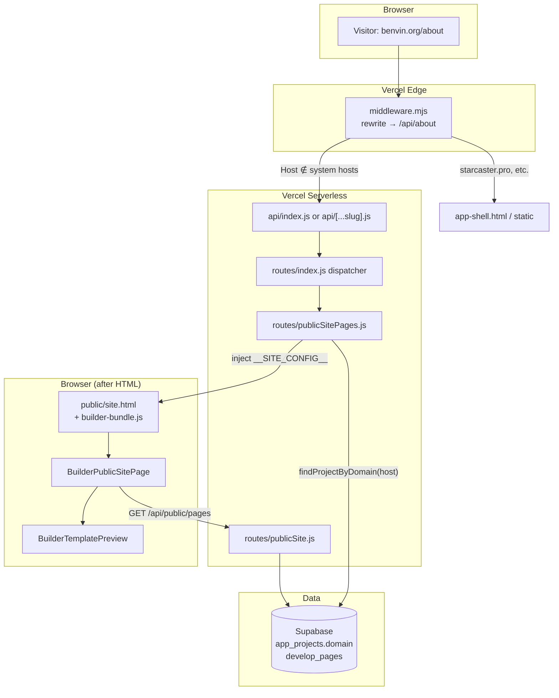

# Custom Domain Public Sites

**Last updated:** 2026-06-25  
**Status:** Production (e.g. `benvin.org` → Marinoff Builder site)

This document describes how StarCaster maps a custom hostname to a tenant’s published Builder pages and serves them at clean URLs (`https://example.com/`, `https://example.com/about`).

---

## 1. What problem this solves

Each StarCaster **project** can optionally own one public hostname (`app_projects.domain`). Visitors on that hostname should see the project’s **published Builder pages** — not the StarCaster admin SPA (`app-shell.html`).

Requirements:

| Requirement | How it is met |
|-------------|----------------|
| Clean URLs | Edge middleware rewrites internally; browser bar stays `/slug` |
| Multi-tenant on one deployment | Domain → project lookup in Supabase (indexed) |
| StarCaster admin unchanged | System hosts (`starcaster.pro`, `*.vercel.app`, localhost) skip public routing |
| Reliability | Layered fallbacks if middleware or rewrites fail (see §5) |
| No prod filesystem writes | Pages from Supabase; HTML shell read from `public/site.html` |

---

## 2. Architecture diagram



### Request path (happy path)

1. **DNS** — Custom domain is a Vercel alias on the StarCaster project (same deployment as `starcaster.pro`).
2. **Edge middleware** (`middleware.mjs`) — For non-system hosts, rewrites `/` → `/api/index`, `/about` → `/api/about`. URL in the browser does not change.
3. **Serverless** — `api/index.js` or `api/[...slug].js` calls `routes/index.js`.
4. **Page router** (`routes/publicSitePages.js`) — Resolves `Host` / `X-Forwarded-Host` via `getClientHost()`, looks up `app_projects.domain`, serves `public/site.html` with injected `window.__SITE_CONFIG__`.
5. **Client** — `BuilderPublicSitePage` fetches published pages from `/api/public/pages`, picks slug from pathname, renders via `BuilderTemplatePreview` inside `.builder-react-root`.

---

## 3. Key files

| File | Role |
|------|------|
| `docs/SQL/app_projects_domain.sql` | DB: `app_projects.domain` column + unique index |
| `lib/projectsStore.js` | `findProjectByDomain()` |
| `lib/publicSiteHosts.js` | `isSystemHost()` — canonical system-host list (Node) |
| `middleware.mjs` | **Primary** clean-URL rewrite (must be `.mjs` / ESM) |
| `vercel.json` | Static assets, `/` → `/api/index`, catch-all → `/api/[...slug]` |
| `api/index.js` | Serverless entry for `/` |
| `api/[...slug].js` | Serverless catch-all |
| `routes/index.js` | Dispatcher; wires `publicSitePages` early for page paths |
| `lib/publicSiteHostBinding.js` | Host ↔ project binding for public APIs |
| `lib/publicSitePageFilter.js` | Excluded admin/editor slugs for public pages API |
| `routes/publicSitePages.js` | HTML routing: public site vs admin shell |
| `routes/publicSite.js` | JSON API: `/api/public/site`, `/api/public/pages` |
| `routes/http.js` | `getClientHost()`, domain path/param helpers |
| `public/site.html` | Public site shell (React mount + styles) |
| `public/app-shell.html` | StarCaster admin SPA (built from `src/layout.html`) |
| `public/index.html` | Minimal fallback redirect to `/api/index` |
| `components/BuilderPublicSitePage.tsx` | Client page resolution + render |
| `builder-react-entry.tsx` | `mountPublicSite()` wraps `.builder-react-root` |
| `server.js` | Local dev: mirrors middleware for custom-domain paths |

---

## 4. Domain configuration

### Database

Apply manually per environment:

```bash
# docs/SQL/app_projects_domain.sql
```

- `app_projects.domain` — hostname without scheme (e.g. `benvin.org`)
- Unique when non-empty (`lower(domain)` index)
- Set via StarCaster project settings UI (saved to Supabase)

### Vercel

1. Add the custom domain as a **domain alias** on the StarCaster Vercel project.
2. Point DNS (A/CNAME) per Vercel instructions.
3. Deploy from `main`; middleware and serverless ship with the app.

### Published pages

- Only pages with `is_published = true` and `is_private = false` are exposed via `/api/public/pages`.
- **Homepage:** slug `""` (empty) or `home` — empty slug takes precedence.
- Admin-only module types are stripped client-side (`blog-post-create`, etc.).

---

## 5. Fallback layers (defense in depth)

If a layer fails, the next one keeps the site reachable (may briefly show internal `/api/*` paths).

| Priority | Layer | When it runs |
|----------|-------|----------------|
| 1 | `middleware.mjs` | Production; rewrites without URL change |
| 2 | `vercel.json` `/` → `/api/index` | If request reaches serverless without middleware |
| 3 | `public/index.html` | If static `/index.html` is served |
| 4 | `app-shell.html` inline script | If admin shell HTML is served on a custom domain; redirects to `/api/index` or `/api{path}` |
| 5 | `site.html` `cleanPublicUrl()` | Cleans address bar after fallback redirects |
| 6 | `/api/_site/{domain}?path=` | Legacy/bootstrap URL for debugging; domain encoded in path |

**Important:** `middleware.mjs` must use the **`.mjs`** extension (ESM). A `middleware.js` file with `export default` and no `"type": "module"` in `package.json` is silently ignored by Vercel.

---

## 6. System vs tenant hosts

Canonical definition: `lib/publicSiteHosts.js` (`SYSTEM_HOST_RE`).

System hosts receive the **StarCaster admin app**, not a tenant site:

- `localhost`, `127.*`, `0.0.0.0`
- `*.vercel.app`
- `starcaster.pro`, `*.starcaster.pro`

`middleware.mjs` duplicates the same regex — **keep in sync** when adding system hosts.

Client-side checks in `src/layout.html` and `public/index.html` mirror this list for fallback scripts.

---

## 7. Debugging

### Response headers

| Header | Meaning |
|--------|---------|
| `X-Site-Handler: resolved` | Custom domain → `site.html` served |
| `X-Site-Handler: bootstrap-resolved` | Legacy `/api/_site/...` path worked |
| `X-Site-Handler: domain-miss` | Custom domain, no `app_projects.domain` match |
| `X-Site-Handler: app-shell` | System host → admin SPA |

### curl examples

```bash
# Project lookup API
curl -s "https://benvin.org/api/public/site?domain=benvin.org"

# Published pages (GET — use -s or -w for status; avoid curl -I which sends HEAD)
curl -s "https://benvin.org/api/public/pages?projectId=proj_..."

# Host binding: wrong projectId should return 403 JSON on GET
curl -s -o /dev/null -w "%{http_code}\n" \
  "https://benvin.org/api/public/pages?projectId=proj_other"
# 403

# Public site shell at /
curl -s "https://benvin.org/" | grep -E "siteRoot|__SITE_CONFIG__|mountPublicSite"

# Direct serverless (bypasses middleware URL, tests handler)
curl -sI "https://benvin.org/api/index" | grep -i x-site

# Legacy bootstrap (still supported)
curl -sI "https://benvin.org/api/_site/benvin.org?path=%2F"
```

**Note:** `curl -I` / `curl -sI` sends a **HEAD** request. Vercel serverless may respond **404** to HEAD even when GET returns **403** with a JSON body. Use GET when checking status codes.

### Local development

`server.js` routes non-system hosts to `handleRequest()` before static files (same logic as production). Use `/etc/hosts` or similar to test `benvin.org` → `localhost:3000`.

---

## 8. Scale and methodology review

### Is this the right approach at scale?

**Yes, for StarCaster’s current model** (many tenants, one shared deployment, Builder pages in Postgres, frequent publishes):

| Approach | Fit |
|----------|-----|
| **Shared deployment + domain lookup** (current) | ✅ Simple ops; one deploy; indexed DB lookup per HTML request |
| Edge rewrite + serverless HTML | ✅ Clean URLs; no per-tenant static builds |
| Client render from `/api/public/pages` | ✅ Publish is instant; no rebuild per page change |
| Separate Vercel project per tenant | ❌ Ops burden; doesn’t scale to hundreds of domains |
| Pre-rendered static export per site | ❌ Rebuild latency; harder dynamic modules (forms, blog) |
| Wildcard DNS + subdomain only (`*.starcaster.pro`) | ⚠️ Possible future add; custom apex domains still need this path |

### Costs at scale

- **Edge middleware** — O(1) per request; no DB; runs only for non-system hosts.
- **Domain lookup** — One Supabase query per HTML page load; mitigated by unique index on `domain`.
- **Pages API** — One query per client navigation; returns up to 200 published pages; home pages sorted first in app code.
- **Vercel domain aliases** — Practical limit depends on Vercel plan; same project can host many aliases.

### Future optimizations (not required now)

- Short TTL cache of `domain → projectId` at edge (Vercel KV) if lookup volume grows.
- CDN cache for `GET /api/public/pages` keyed by `projectId` + `updated_at` watermark.
- Filter admin slugs (`admin-login`, etc.) server-side before public API returns.

---

## 9. Adding a new custom domain (checklist)

1. Apply `docs/SQL/app_projects_domain.sql` if not already on the environment.
2. In StarCaster: open project → save **Domain** (e.g. `client.com`).
3. Publish Builder pages (empty slug or `home` for homepage).
4. Vercel: add `client.com` as domain alias; configure DNS.
5. Deploy latest `main`.
6. Verify: `curl -sI https://client.com/ | grep siteRoot` (body) and Marinoff-style content in browser.

---

## 10. Security & tenant isolation

### What is already enforced

| Safeguard | Effect |
|-----------|--------|
| **Unique `app_projects.domain`** | DB unique index + 409 on save — two projects cannot claim the same hostname |
| **Server-side HTML routing** | `resolvePublicSiteProject()` maps Host → project before injecting `__SITE_CONFIG__`; visitors cannot pick another tenant’s shell by URL alone |
| **System host list** | `starcaster.pro`, `*.vercel.app`, localhost → admin SPA, never tenant site |
| **Edge middleware scope** | Rewrites apply only to non-system hosts |
| **Published-only pages API** | `listPublishedPagesForProject()` filters `is_published` + `is_private = false` |
| **Cookie host isolation** | `app_session` on `starcaster.pro` is not sent to `benvin.org` (browser same-origin policy) |
| **Platform API auth** | Almost all `/api/*` routes require login; public allowlist is small (see below) |

### Public API allowlist (no platform login today)

- `GET /api/public/site`, `GET /api/public/pages`
- `POST /api/contact`, `POST /api/crm/contact-submit`
- `GET /api/crm/forms/:id` (form config for embedded CRM forms)

Everything else returns **401** without a session — but a session obtained **on the custom domain** (e.g. via a published admin-login page) would still work against authenticated routes. Treat unpublished admin slugs as a publishing discipline issue until server-side slug filtering lands.

### Known gaps (ranked)

| Priority | Gap | Risk | Status |
|----------|-----|------|--------|
| **High** | `GET /api/public/pages?projectId=` accepts any project ID | Cross-tenant **read** of published page JSON | **Fixed** — `lib/publicSiteHostBinding.js` |
| **High** | `POST /api/contact` and `/api/crm/contact-submit` trust client `projectId` | Cross-tenant **write** | **Fixed** — same host binding |
| **Medium** | Authenticated `/api/*` reachable from tenant hostname | Admin login on public site + session | Deferred — custom-domain API allowlist (#2) |
| **Medium** | Admin slugs (`admin-login`, etc.) can be published | Public exposure of admin UI | **Fixed** — `lib/publicSitePageFilter.js` |
| **Low** | Legacy `/api/_site/{domain}?path=` bootstrap | Domain probing | Keep for ops |
| **Low** | No CSP on `site.html` | XSS on tenant site | Future |

### Hardening modules

| Module | Role |
|--------|------|
| `lib/publicSiteHostBinding.js` | On custom domains, `projectId` / `domain` query must match `findProjectByDomain(host)` |
| `lib/publicSitePageFilter.js` | Drops `admin-*`, editor, and CRM admin slugs from `/api/public/pages` |

System hosts (`starcaster.pro`, localhost, …) skip host binding so Builder preview and local dev keep working.

### Recommended hardening roadmap

1. ~~**Host-bind public reads/writes**~~ — done (see modules above).
2. **Custom-domain API fence** — early in `routes/index.js`: if `!isSystemHost(host)` and path is not in the public allowlist → **403** (even with valid session). Planned after more public-module audit.
3. ~~**Filter admin pages server-side**~~ — done via `publicSitePageFilter`.
4. **Rate limits** — per-IP limits on `/api/public/*` and form POST endpoints (reuse `lib/rateLimiter.js`).
5. **Operational** — one Vercel project per environment; domain aliases only for verified tenants.

### What “no bleed” means in practice

- **Wrong site HTML on wrong domain** — already prevented by host → project lookup for page routing.
- **StarCaster admin on client domain** — prevented by middleware + system host list + fallbacks that check `#siteRoot`.
- **Client A data on Client B domain** — host-binding on public APIs and form POSTs is enforced; API allowlist (#2) still deferred.

---

## 11. Related docs

- `docs/Markdown Files/AI_AGENT_HANDOFF.md` — project overview
- `docs/builder-port.md` — Builder React / CSS scoping (`.builder-react-root`)
- `docs/SQL/app_projects_domain.sql` — schema migration
